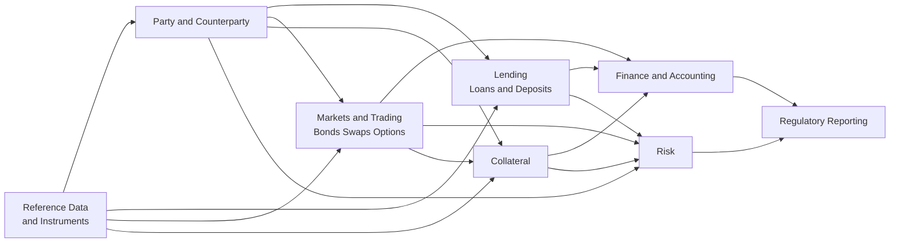
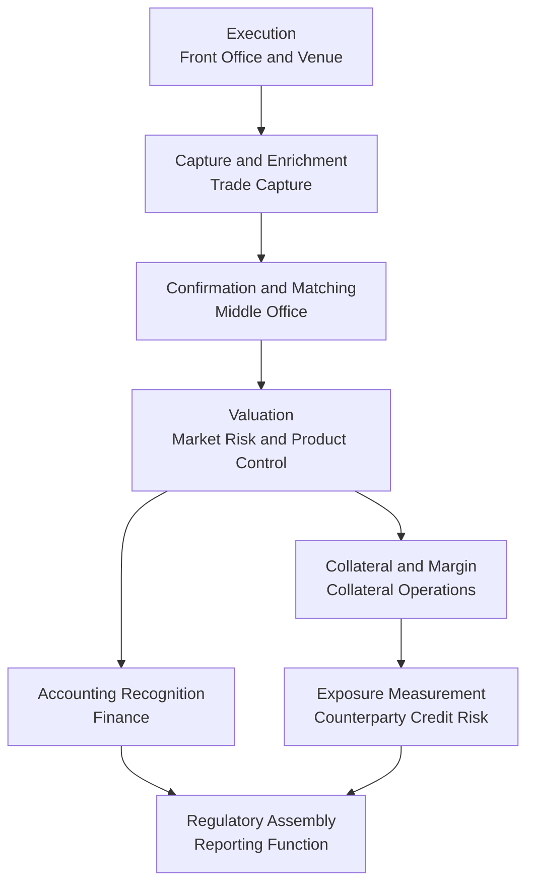

# Domain data flows

*How data moves between domains, what a domain guarantees another, and what happens to meaning at the boundary.*

---

## Purpose and scope

This document describes the domain structure of a banking data estate, the direction of dependency between domains, the contracts that govern their boundaries, and — the part that earns its length — **what happens to a concept when it crosses a boundary**.

The boundary is where architecture is actually decided. Inside a domain, a modelling error is contained and correctable. At the boundary, a modelling error becomes two teams' shared, undocumented assumption, and it survives for a decade. Most of the reconciliation effort in a bank exists because a concept crossed a boundary and quietly changed meaning while keeping its name.

Companion to [`target-and-transition-states.md`](target-and-transition-states.md) and [ADR-0001](../governance/adr/0001-canonical-domain-model-over-point-to-point.md).

---

## 1. The domain map

### 1.1 Domains and dependency direction



**Read the arrows as "supplies".** An arrow from A to B means A publishes data that B consumes, and therefore B depends on A. The upstream domains — Reference Data, Party — are the most stable and the most widely depended upon. The downstream domains — Finance, Risk, Regulatory Reporting — are the most volatile, because regulatory change lands on them first.

### 1.2 Dependency direction is a decision, not an accident

The shape above is chosen, and the choice follows one principle: **stable things are depended upon; volatile things depend.**

Reference Data and Party sit upstream because their concepts change on the timescale of market structure and legal entity restructuring — years. Regulatory Reporting sits at the bottom because its structure changes whenever a supervisor publishes an amendment. If the arrow ever runs the other way, a reporting amendment propagates upstream into the estate's most widely shared domain, exposing every consumer of Party to a change that has nothing to do with them. This happens more often than architects admit, and it looks innocuous: a regulatory classification flag added to the counterparty record because that is where it is convenient to store it. The flag is defined by a reporting framework, changes with that framework, and is now embedded in the most shared entity in the estate. That is an inverted dependency wearing a small disguise.

The rules:

| Rule | Statement |
|---|---|
| **D1** | Dependency runs from stable to volatile. A domain may depend on a more stable domain, never the reverse. |
| **D2** | **Cycles between domains are a defect**, not a trade-off. If A depends on B and B depends on A, at least one concept is in the wrong domain, or one domain is actually two. |
| **D3** | Dependency is on a **published contract**, never on internal structures (DP-10). |
| **D4** | Framework-specific concepts live in the lens layer, never upstream (DP-11, DP-12). |
| **D5** | A domain that needs something from a downstream domain has found a modelling error. Fix the model, do not add the arrow. |

**On breaking a cycle.** The apparent cycles in this estate are nearly always one of three things, and all three have a standard resolution:

| Apparent cycle | What it really is | Resolution |
|---|---|---|
| Risk needs a counterparty rating; the rating is produced by Risk | Two different concepts sharing a name: an *external* rating (reference data) and an *internal* rating (a Risk output) | Split them. Reference Data owns external ratings; Risk owns internal ones and publishes them as a Risk product. No cycle. |
| Finance needs a valuation; the valuation is produced downstream | The valuation is a Markets domain output, not a Finance output | Valuation belongs to Markets and is published upstream of Finance. |
| Collateral needs exposure; exposure is calculated by Risk | Collateral needs *positions*, not *exposure* | Collateral consumes positions from Lending and Markets. Exposure is Risk's derived concept and stays there. |

### 1.3 What each domain owns

| Domain | Owns | Consumes | Publishes |
|---|---|---|---|
| **Reference Data and Instruments** | Instrument master, issuer linkage, product taxonomy, code lists, market and calendar data, external identifier cross-reference | External data vendors, standards bodies | Instrument records, code lists with effective dates, identifier cross-reference |
| **Party and Counterparty** | Legal entity identity, hierarchy and group structure, identity resolution across systems, party roles | Onboarding, KYC, external entity reference sources | Canonical Party, group hierarchy, identity cross-reference |
| **Lending** | Loan and deposit arrangements, balances, schedules, arrears and forbearance status, lifecycle events | Party, Reference Data | Arrangement, Position, credit lifecycle events |
| **Markets and Trading** | Trades and lifecycle events for bonds, swaps and options; positions; valuations | Party, Reference Data | Trade Event, Position, valuation |
| **Collateral** | Collateral agreements, pledged and received assets, margin calls, eligibility, haircuts | Party, Reference Data, Lending, Markets | Collateral agreement and holding, margin status |
| **Finance and Accounting** | Accounting classification and measurement, ledger balances, accounting events, the close | Lending, Markets, Collateral | Accounting-basis positions and balances |
| **Risk** | Exposure measurement, netting sets, internal ratings, default and impairment inputs, limits | Party, Lending, Markets, Collateral | Exposure, netting set, risk classification |
| **Regulatory Reporting** | Framework interpretation, template assembly, submission, taxonomy binding | Finance, Risk | Submission datasets and filed returns |

Regulatory Reporting **owns no business concept**. It owns interpretation and assembly. Every fact it reports originates in a domain that owns it. The moment reporting starts creating facts — a counterparty that exists only in a reporting mart, a product classification maintained by the reporting team — the architecture has been inverted and the estate has gained a concept with no owner.

---

## 2. Domain interface contracts

### 2.1 What a contract must state

A domain interface contract is the published, versioned guarantee one domain gives another. Without it, consumers depend on observed behaviour, and observed behaviour is not a commitment — which is how a schema change made on a Tuesday breaks a quarter-end.

| Element | What it commits |
|---|---|
| **Schema** | Fields, types, nullability, cardinality. Machine-readable and version-controlled. |
| **Semantics** | What each field *means*, in a definition that survives being read aloud to a business stakeholder (DP-15). Includes population scope and exclusions — usually the part that is missing and always the part that causes the incident. |
| **Identity** | The business key and its stability guarantee (DP-05, DP-09). Whether keys are reused, and what a correction looks like. |
| **Temporality** | As-of semantics. Whether the dataset is a snapshot or an event stream; whether it is bi-temporal; how restatements appear (DP-30, DP-31). |
| **Freshness and SLA** | Availability time, frequency, cut-off convention, late-arrival policy, behaviour under a failed upstream run. |
| **Quality** | Declared expectations with severities, and what the consumer should expect when one fails: suppression, publication with a flag, or nothing (DP-21, DP-23, DP-24). |
| **Classification** | Confidentiality classification per attribute, driving entitlement (DP-26, DP-27). |
| **Versioning** | Current version, supported versions, and the deprecation policy with notice periods. |
| **Ownership** | Named owner and steward, plus the route for raising a defect (DP-01, DP-02). |
| **Consumers** | Declared consumers. A contract with no declared consumers is undeprecatable and unimpactable. |

### 2.2 Example contract

```yaml
contract: party.counterparty
version: 3.2.0
owner: Head of Party Data
steward: Party Data Steward
status: current

purpose: >
  Canonical legal entity record for any party with which the group has or may
  have a contractual relationship. One row per legal entity per valid-time
  period. This is the authoritative counterparty identity for all downstream
  domains.

identity:
  business_key: [party_identifier_scheme, party_identifier]
  key_stability: immutable
  corrections: emitted as a correction event, never an in-place update  # DP-09
  external_identifiers: [lei, national_registration_identifier]
  # note: not every entity has an LEI - absence is expected, not a defect

temporality:
  type: bi-temporal                    # DP-30
  valid_time: legal effective date of the attribute
  transaction_time: recorded time in the canonical layer
  restatements: new version emitted; prior versions retained  # DP-31

schema:
  - {name: party_identifier, type: string, nullable: false, classification: internal}
  - {name: legal_name, type: string, nullable: false, classification: internal}
  - {name: legal_entity_status, type: enum, nullable: false,
     code_list: party.legal_entity_status, code_list_version: 4}
  - {name: country_of_incorporation, type: string, nullable: false,
     code_list: iso.country}
  - {name: immediate_parent_party_identifier, type: string, nullable: true,
     note: null where the entity is an ultimate parent or the parent is unknown}
  - {name: ultimate_parent_party_identifier, type: string, nullable: true}

semantics:
  population: >
    All legal entities in a counterparty role, including inactive entities
    retained for historical reporting. Natural persons are OUT OF SCOPE and
    are published separately under party.individual.
  exclusions: [prospects not yet onboarded, internal non-legal cost centres]
  known_limitations: >
    Group hierarchy reflects legal ownership only. It is NOT the prudential
    connected-client grouping and must not be used as such - see section 3.1.

freshness:
  frequency: daily
  available_by: 06:00 local, business days
  cut_off: previous business day close
  late_arrivals: republished next cycle with a corrected valid-time record

quality:                                # DP-21, DP-23
  - {rule: business key present and unique, severity: blocker}
  - {rule: country of incorporation is a live code-list value, severity: error}
  - {rule: parent reference resolves to a known party, severity: error}
  - {rule: hierarchy contains no cycles, severity: blocker}

versioning:
  supported: [3.x]
  deprecated: [2.x]
  deprecation_end: 2027-03-31
  breaking_change_notice: two full reporting cycles, minimum one quarter

consumers:
  - lending.arrangement
  - markets.trade
  - collateral.agreement
  - risk.exposure
  - finrep.lens
  - ccr.lens
```

### 2.3 Breaking versus non-breaking

The definition must be written down, because "breaking" is otherwise decided by whoever is under the most schedule pressure.

| Change | Breaking | Note |
|---|---|---|
| Adding an optional field | No | Consumers must tolerate unknown fields; state this in the platform standard |
| Removing a field | **Yes** | Even if the producer believes nobody uses it. The lineage graph decides that, not the producer |
| Narrowing a type or tightening nullability | **Yes** | Consumers may break on data they previously accepted |
| Widening a type | Usually yes | Consumer storage and validation may not accommodate it |
| Adding a code-list value | **Yes, in effect** | Frequently mishandled. Consumers with exhaustive mappings will fail or silently misclassify. Treat as breaking unless every consumer has declared a default (DP-38) |
| Retiring a code-list value | **Yes** | Requires an effective date and a mapping for historical data |
| Changing a field's *meaning* without changing its schema | **Yes, and the most dangerous kind** | Nothing technical detects it. Only definitional governance catches it |
| Changing population scope or exclusions | **Yes** | A silent population change is indistinguishable downstream from a data quality incident |
| Changing the business key or its stability | **Yes** | The most expensive change available; treat as a new contract |
| Moving the availability time later | **Yes** | An SLA is part of the contract |

### 2.4 How a breaking change is announced

| Step | Requirement |
|---|---|
| **Impact assessment first** | Consumers enumerated from the lineage graph, not from memory ([ADR-0003](../governance/adr/0003-lineage-as-a-first-class-artefact.md)). Cross-lens impact assessed where regulatory outputs are affected (DP-35) |
| **Classify** | Impact classification recorded per DP-33; regulatory-facing changes require design authority approval |
| **Notice** | Minimum notice defined in the contract and measured in *reporting cycles*, not weeks. A month's notice that lands inside a quarter-end is not notice |
| **Parallel versions** | Old and new versions published concurrently for the deprecation window. Consumers migrate on their own schedule inside it |
| **Deprecation is dated at announcement** | Not "in due course". A deprecation without an end date never ends |
| **Retire and prove it** | Old version withdrawn; lineage confirms no remaining consumers |

Producers resist this because it is slower. It is slower. It is also the only thing that lets a consumer commit to a period-end date, and a domain that cannot be depended upon will be worked around — usually by someone reading its internal tables directly, which is how the estate got here.

---

## 3. Where concepts cross boundaries and get distorted

This is the section worth reading twice. Everything above is structure; this is meaning, and meaning is where the money goes.

### 3.1 One counterparty, three concepts

A single organisation appears in three domains and is, legitimately, three different things:

| Domain | What it is | Grain | Governed by |
|---|---|---|---|
| **Reference Data / Party** | A legal entity with a registered identity, jurisdiction and ownership structure | One legal entity | Company law, entity reference standards |
| **Risk** | A source of credit exposure, aggregated to a group of connected entities | A grouping that may span legal entities, and may split one | Prudential rules on connected clients and default definitions |
| **Finance** | A customer relationship, possibly spanning entities and products, mapped to accounting and segment structures | A relationship, often a commercial construct | Accounting framework, segment reporting, internal MI structures |

**Why it happens.** All three are correct within their own frame. Risk aggregates because economic dependence, not legal separation, determines whether exposures fail together. Finance aggregates because commercial relationships and reporting segments do not follow legal boundaries. Reference Data must not aggregate at all, because legal identity is the only stable anchor. The distortion arises when one grain wins and the others are forced to adopt it — classically, the Risk grouping becomes *the* counterparty because it is what the first reporting programme needed, and it propagates into the shared party record. From then on the estate cannot answer a legal-entity question without unpicking a risk aggregation.

**Architectural treatment:**

1. **One canonical Party at legal-entity grain**, non-negotiable, because legal entity is the only grain that is externally verifiable and stable over time.
2. **Groupings modelled as first-class, named, typed relationships over Party** — legal ownership hierarchy, prudential connected-client grouping, commercial relationship grouping. Distinct structures, owners and rules, all resolving to the same Party identifiers.
3. **No grouping is called "the group".** Naming discipline does more work here than any technical control: if someone writes `group_id`, the next reader assumes it is the one they have in mind.
4. **Each grouping is owned by the domain whose rules define it.** Risk owns the prudential grouping, Finance the commercial one, Party legal ownership. Party does not adjudicate the other two.
5. **The lens layer selects the grouping appropriate to the framework**, and never redefines it.

### 3.2 A trade whose dates disagree

One derivative carries several dates that are routinely collapsed into "the trade date", and the collapse is silent:

| Date | Meaning | Owned by |
|---|---|---|
| **Execution** | The point of legal agreement between the parties | Markets |
| **Effective** | When economic terms begin to accrue | Markets |
| **Confirmation** | When terms are matched and affirmed with the counterparty | Markets / Operations |
| **Settlement** | When exchange of cash or assets occurs | Operations |
| **Accounting recognition** | When the transaction enters the ledger under the accounting framework | Finance |
| **Reporting reference** | The date determining which reporting period the item falls into | Lens layer |

**Why it happens.** These dates coincide often enough that a single field appears sufficient, then diverge exactly when it matters: at period end, around holidays, across time zones, and for trades executed late in a session. A trade executed on the final day of a period may be recognised in the ledger in the following one. Both treatments are correct under their own rules; a single `trade_date` field forces one of them to be wrong.

**Architectural treatment:** Trade Event carries **all** economically and operationally meaningful dates as distinct, separately named attributes; none is called `trade_date`. Accounting recognition is a **separate event with its own date**, not an attribute of the trade, because it has a different owner, trigger and lifecycle. Each lens declares explicitly which date drives period assignment, and that declaration is part of its documented interpretation rather than an implementation detail. The reconciliation between economic and accounting period assignment then becomes a **derivable, explainable difference** rather than a recurring quarter-end mystery.

### 3.3 Netting sets: real in Risk, meaningless in Finance

A netting set is a group of transactions with a counterparty covered by a legally enforceable netting agreement, treated as a single exposure for prudential measurement. It is central to counterparty credit risk: exposure is measured over the set, not the individual trade.

In Finance it has **no meaning at all**. Offsetting of financial assets and liabilities under the accounting framework is permitted only where restrictive criteria are met — broadly, an enforceable right of set-off together with intent to settle net or realise simultaneously — which is a different test with a different population. The same trades are typically presented gross for accounting and net for prudential purposes, and both are correct.

**Why it happens.** Someone building an integration layer sees "netting" in two places, assumes one concept, and creates a shared field. Downstream, an accounting figure inherits a prudential netting treatment, or a risk figure inherits an accounting one. This is not a rounding difference; it is a materially different number produced by a defensible-looking mapping.

**Architectural treatment:**

- The netting set is a **Risk-owned construct**, modelled in Risk, published as part of the Risk domain product. It does not exist in the canonical trade model and it must not be pushed upstream.
- The canonical layer holds the **facts both lenses need**: the trades, the counterparty, the legal agreement and its enforceability status, the collateral arrangement. The *grouping* is a lens-layer construction.
- Finance's offsetting assessment is a **separate lens-layer determination** driven by accounting criteria, sharing the same underlying agreement facts and reaching its own conclusion.
- Neither lens is permitted to consume the other's grouping. This is exactly the "one model, two lenses" boundary in [ADR-0002](../governance/adr/0002-one-model-two-lenses.md).

### 3.4 Instrument identifiers that are not stable

Instrument identity is harder than it looks, and the estate usually discovers this late.

| Problem | Manifestation |
|---|---|
| **Not everything has a public identifier** | Securities identifiers exist for issued instruments. Bilateral OTC derivatives are not issued and have no such identifier — they have a trade identifier and a product classification, which are different things |
| **Identifiers get reused and reassigned** | Public identifiers can be reallocated after long periods, and are reassigned across corporate actions |
| **One instrument, several identifiers** | An international identifier, national identifiers, exchange-level codes, and vendor-internal codes. Cross-reference is many-to-many across time |
| **Corporate actions change identity** | A restructuring may leave a "same" instrument with a new identifier, or a genuinely different instrument with the old one |
| **Product classification differs by framework** | Classification standards, internal product taxonomies and framework-specific categorisations do not map cleanly onto one another |
| **Vendor codes leak into the model** | An identifier from whichever vendor was in use becomes the de facto key, embedding a supplier dependency in the estate's history |

**Architectural treatment:** the canonical Instrument carries an **internal surrogate identity** that is opaque and permanent (DP-06). External identifiers are **attributes with validity periods**, held in a cross-reference structure, never used as the primary key (DP-08). Identity resolution is an **explicit, owned, auditable process** with recorded confidence and a manual review path, not an incidental join (DP-07). Corporate action handling is modelled as **events on Instrument** with an explicit continuity relationship, so the question "is this the same instrument as before" has a recorded answer rather than an inferred one. Framework-specific classification lives in the lens layer, mapped from canonical classification through a governed mapping (DP-39).

### 3.5 The pattern behind all four

| Symptom | Underlying cause | Standard treatment |
|---|---|---|
| One name, several meanings | A polyseme accepted at the boundary | Split the concept, name each precisely, own each separately |
| One field, several times | Temporal semantics collapsed | Model every meaningful date distinctly; let each lens declare its choice |
| A construct pushed upstream | A lens concept placed in the canonical layer | Keep framework constructs in the lens; keep the shared facts canonical |
| An external key used as identity | Convenience key adopted as primary key | Internal opaque identity; external identifiers as time-bounded attributes |

**The general rule: when two domains disagree about what something means, the answer is almost never to pick a winner.** It is to establish that there are two concepts, name them separately, assign each an owner, and model the relationship between them. Picking a winner destroys information that the losing domain is required to report.

---

## 4. Golden source designation

Exactly one golden source per attribute per domain (DP-36), with the designation recorded together with the reason (DP-37). The reason matters as much as the designation: an undocumented designation is re-litigated at every reorganisation.

### 4.1 The decision procedure

| Test | Question | Weight |
|---|---|---|
| **1. Creation** | Which system does the business process that *creates* this fact run in? | Strongest signal |
| **2. Authority** | Which system's version does the business act on when they disagree? | Very strong |
| **3. Completeness** | Which holds the full population, not a filtered subset? | Strong |
| **4. Timeliness** | Which reflects the change first? | Moderate |
| **5. Control** | Which has the stronger controls, audit trail and ownership? | Moderate |
| **6. Accessibility** | Which can actually be integrated with? | Tie-break only |

Accessibility is a tie-break and nothing more. Designating a golden source because it is the easiest to extract from is how a downstream reporting mart ends up authoritative for a fact it does not create — an inversion that is very hard to reverse once other consumers have attached to it.

### 4.2 "The system that creates it" — usually right, not always

The creation heuristic is the best single test, and these are the exceptions:

| Exception | Example | Correct designation |
|---|---|---|
| **The creating system does not retain it** | A channel captures a customer attribute and passes it on without storing history | The system that retains the governed record |
| **The fact is externally determined** | Instrument static data, credit ratings, market identifiers | The external source via the domain that curates it — an internal system holding a copy is a cache, not a source |
| **Creation is distributed across channels** | Customer details captured in several channels | The consolidating master, with resolution rules owned and documented |
| **The creating system is being decommissioned** | A legacy platform in run-off | The strategic system, with the legacy one authoritative for historical periods only, explicitly time-bounded |
| **The fact is derived, not captured** | Exposure, expected credit loss, internal rating | The system that *computes* it, with the computation versioned. Derived facts have a golden *calculator*, not a golden source |
| **Legal or regulatory determination** | Legal entity status, official registration data | The official register, via the domain that curates it |

### 4.3 When two systems both legitimately hold a version

This is common and usually mishandled by declaring one wrong. First, **establish whether they are the same attribute.** Most of the time they are not: a trading system's valuation and a product control valuation differ because they are produced for different purposes with different inputs, controls and timing. Those are two attributes with two owners and two golden sources, and they should be named differently — forcing them into one field destroys the control that the second valuation exists to provide. If they genuinely are the same attribute, resolve in this order:

| Order | Action |
|---|---|
| **1** | Apply the decision procedure and designate one, recording the reason (DP-37) |
| **2** | Model the other as a **declared secondary** with a documented purpose, never silently retained as a shadow copy |
| **3** | Make the difference **measurable**: an owned, monitored reconciliation with a tolerance and a named owner for breaches (DP-24) |
| **4** | If the secondary is materially better on some dimension, that is evidence the designation is wrong — revisit it rather than tolerating a permanent divergence |
| **5** | If neither can be designated because ownership is genuinely contested, escalate to the design authority. **Do not resolve it by building a third system** — the third system becomes a fourth version |

---

## 5. Trade lifecycle across domains

Following one interest rate derivative from execution to submission. Described conceptually: actors and the data each contributes. Message formats, field names and identifier scheme details vary by market, venue and jurisdiction and must be taken from the applicable standards and rulebooks rather than assumed.



| Stage | Actor | What it contributes to the data | Owning domain |
|---|---|---|---|
| **Execution** | Front office, trading venue or bilateral negotiation | Economic terms: counterparty, notional, rates, dates, direction. The execution timestamp — which is a regulatory fact in its own right for transaction reporting, not merely an operational one | Markets |
| **Capture and enrichment** | Trade capture system | Internal trade identity, book and desk attribution, product classification, counterparty resolution to canonical Party, instrument resolution | Markets, using Party and Reference Data |
| **Confirmation and matching** | Middle office, confirmation platform | Confirmation status and timestamps, affirmed economic terms, discrepancy records. Establishes that the two parties agree what was traded — the point at which the trade becomes legally robust | Markets / Operations |
| **Valuation** | Market risk, product control | Fair value, valuation date, valuation basis and inputs, model identity and version, independent price verification outcome and any adjustments | Markets, with Finance controls |
| **Collateral and margin** | Collateral operations | Applicable collateral agreement and its terms, margin calls, collateral pledged and received with eligibility and haircut treatment, disputes | Collateral |
| **Accounting recognition** | Finance | Accounting classification and measurement basis, recognition date, ledger postings, hedge designation where applicable, presentation and offsetting determination | Finance |
| **Exposure measurement** | Counterparty credit risk | Netting set assignment, current exposure, potential future exposure, collateral recognition, aggregation to counterparty and connected group, limit consumption | Risk |
| **Regulatory assembly** | Reporting function | Framework interpretation, population scoping, breakdown assignment, template assembly, validation, submission | Regulatory Reporting (lens layer) |

### 5.1 What the lifecycle reveals

**One trade generates facts owned by five domains.** No single system holds the complete picture, and none should. Attempts to build one produce either an unmaintainable monolith or a reporting mart that has quietly become a system of record.

**The same trade is reported under several frameworks with different grains and deadlines.** Transaction reporting regimes take individual transactions close to real time; prudential and financial reporting take aggregated positions periodically. They must nonetheless be reconcilable, because a supervisor is entitled to ask why the transaction population and the position population disagree. That reconcilability is an architectural property — both descend from the same canonical Trade Event — and it cannot be retrofitted.

**Lifecycle events are the hard part, not the new trade.** Amendments, partial terminations, novations, compressions and exercises change the economics of an existing trade. A model that treats a trade as a mutable row loses the history and cannot reproduce a prior period. Trade Event is **event-based and append-only**; current state is derived, not stored as the truth.

**Timing differences between stages are structural, not exceptional.** A trade executed near a period boundary may be confirmed, valued, collateralised and recognised in different periods. Represent this faithfully rather than forcing alignment — which is why every stage carries its own dated event.

---

## 6. Reference data and code-list governance

### 6.1 Why reference data is disproportionately damaging

Reference data is a small fraction of the volume and a large fraction of the incidents, for four structural reasons. It is **shared by every domain**, so an error propagates everywhere at once rather than being contained. It is **used in classification and grouping**, so an error changes which bucket a figure lands in — which is exactly what supervisory reporting is made of. It changes **infrequently**, so nobody is watching and the controls are weaker than around transactional data. And its errors are **silent**: a wrong balance looks wrong, whereas a wrong country code produces a perfectly plausible figure in the wrong row.

### 6.2 The recurring problems

| Problem | Consequence | Treatment |
|---|---|---|
| **Code lists without effective dates** | Prior periods cannot be reproduced; a list edited in place silently rewrites history | Every code list versioned and effective-dated (DP-38); reporting pins the version applicable to the period (DP-40) |
| **Local copies drifting** | Each domain holds a stale copy with local additions | One owned publication per code list, consumed through a contract; local extension prohibited |
| **Mappings buried in code** | The mapping between an internal taxonomy and a framework taxonomy lives in a transformation nobody reviews | Mappings are **governed artefacts** with an owner, a version and a review cycle (DP-39) |
| **Unmapped values handled silently** | A new source value falls into a default bucket and misstates a breakdown | Unmapped values are an **error with a severity**, routed to an owner. Never silently defaulted |
| **Taxonomy updates applied globally** | A framework taxonomy update is applied to all periods, breaking comparatives | Taxonomy version pinned per reporting period; historical periods reproduce on their original version |
| **Mappings that are not bijective** | An internal category maps to several framework categories, resolved by an undocumented rule | The disambiguating rule is part of the mapping artefact, reviewed and owned, not implicit in code ordering |

### 6.3 Mapping as a governed artefact

A mapping from an internal taxonomy to a framework taxonomy is a **regulatory interpretation expressed as data**. It determines which figures appear in which supervisory breakdown. It deserves the governance of an interpretation, not of a lookup table:

| Requirement | Detail |
|---|---|
| **Owner** | Named, from the domain owning the interpretation — typically the lens owner, not the platform team |
| **Reviewer** | The function accountable for the report |
| **Version and effective date** | Every version retained; prior periods resolve to their contemporaneous version |
| **Rationale** | Why each non-obvious mapping decision was made, recorded at decision time |
| **Completeness check** | Every live source value mapped; the check runs in the pipeline, not in a review |
| **Change control** | Material changes assessed for cross-lens impact (DP-35) and for restatement (DP-31) |

### 6.4 On integrated reporting dictionaries

Two ECB-published initiatives are the right open anchors, and are worth understanding before designing a bespoke structure. **BIRD** — the Banks' Integrated Reporting Dictionary — is a collaborative, publicly available description of an **input layer**, a set of **transformation rules** and an **output layer**, covering AnaCredit, FINREP and statistical reporting requirements. Its architecture is the same argument this repository makes: describe the granular input once, express reporting as transformations over it, derive multiple outputs. It is voluntary, and its value is partly as a published reference for the transformation approach rather than as something to adopt wholesale. **IReF** — the Integrated Reporting Framework — sits alongside it, aimed at integrating statistical reporting requirements for euro-area banks into a single collection layer.

Both are worth mapping the canonical model against, and DP-14 requires reference-model alignment to be recorded. Where a canonical entity corresponds to a BIRD input-layer concept, record it; where it deliberately differs, record why. That record is a cheap, durable defence of the model's design.

A note on proprietary models: established vendor banking data models — the Teradata FSLDM among them — are legitimate points of comparison and may be named as industry reference points. They are licensed intellectual property and are not reproduced or paraphrased here. Where an organisation licenses one, aligning to it is reasonable; this repository anchors on the openly published ECB material precisely because it can be cited, checked and shared.

---

## 7. Document control

| Item | Value |
|---|---|
| Owner | Domain Data Architect |
| Approval body | Data Architecture Forum / Design Authority |
| Review cycle | Annual, or on material change to the domain structure |
| Related decisions | [ADR-0001](../governance/adr/0001-canonical-domain-model-over-point-to-point.md), [ADR-0002](../governance/adr/0002-one-model-two-lenses.md), [ADR-0003](../governance/adr/0003-lineage-as-a-first-class-artefact.md) |
| Companion documents | [`target-and-transition-states.md`](target-and-transition-states.md), [`methodology-decision.md`](methodology-decision.md), [`../governance/data-policy-standards.md`](../governance/data-policy-standards.md) |

*Reference architecture, not a compliance artefact. Synthetic data throughout. Regulatory frameworks, identifiers and reporting regimes are described at a conceptual level only — verify all detail against the current published EBA, ECB and ESMA texts and the applicable accounting standards before relying on it for any submission.*
