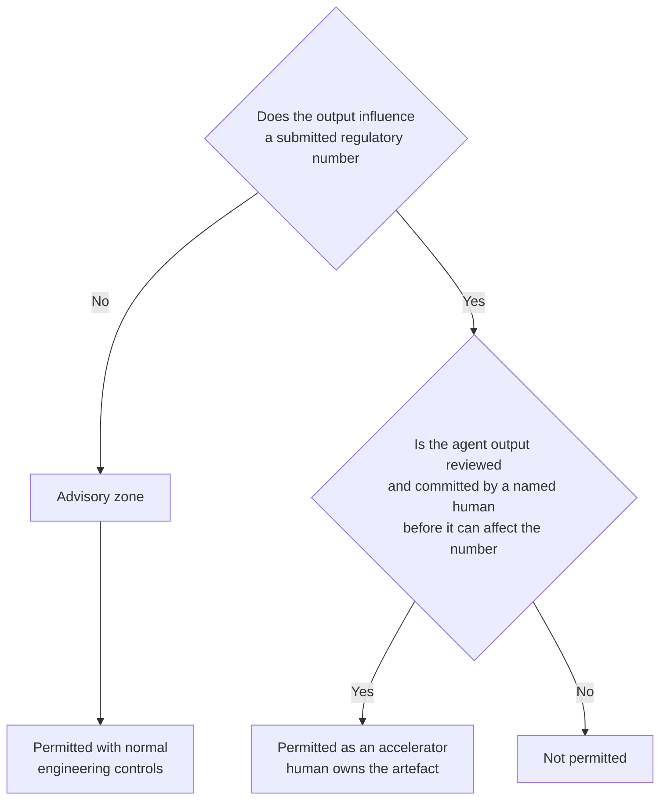

# Methodology decision

*Lake, warehouse, mesh, fabric, lakehouse, hybrid, agentic — evaluated against the obligations of a regulated banking domain rather than against each other.*

---

## Purpose and scope

This document sets out the reasoning behind the architectural pattern chosen for a banking data domain that carries a regulatory reporting obligation. The decision itself is recorded in [ADR-0004](../governance/adr/0004-target-architecture-lakehouse-hybrid.md); this is the longer analysis that the ADR compresses, written for architects who need to defend the choice, and for anyone who wants to challenge it properly.

The conclusion is a **governed lakehouse with domain ownership** — a deliberate hybrid. That is stated up front because the interesting content is the reasoning and, in particular, the conditions under which the conclusion would change.

---

## 1. Criteria before options

Most methodology debates in this space are unwinnable because they start in the wrong place: with the options. Someone advocates mesh, someone else advocates a warehouse, and the discussion becomes a comparison of characteristics with no agreed basis for weighing them. Both parties are right about their pattern's strengths and neither can demonstrate that those strengths are the ones that matter here.

**Choosing the criteria before looking at the options is the whole discipline.** Once criteria are derived from the obligations — written down, weighted and agreed — most of the argument resolves mechanically, and the residual disagreement is a genuine one about weightings, which is a productive thing to disagree about.

There is a second reason for the ordering, and it is less comfortable: criteria chosen after the options have been seen are chosen to favour a preferred option. This happens without anyone intending it. The only defence is sequence.

### 1.1 The criteria

Derived from what the obligation actually demands, not from what platforms advertise:

| # | Criterion | What it demands | What failure looks like | Weight |
|---|---|---|---|---|
| **C1** | **Reproducibility of a submitted report** | Any submitted figure regenerable exactly, for its full retention period, from pinned data, code, reference data and lineage (DP-29, DP-34) | A supervisor asks about a figure from two years ago and the answer is a reconstruction, not a regeneration | **Critical** |
| **C2** | **Field-level lineage** | For every regulatory-facing field, a traceable path back to source, emitted by the pipeline rather than documented by hand (DP-18, DP-19) | Lineage is a diagram maintained separately from the code, and diverged from it some time ago | **Critical** |
| **C3** | **Accountability for a number** | One named accountable executive per submission, with an unbroken chain from that person to every contributing input (DP-04) | Everyone contributed; nobody is answerable; the escalation route ends in a committee | **Critical** |
| **C4** | **Consistency of shared concepts** | Counterparty, default, exposure, netting set mean one thing across every contributing domain, or the difference is explicit and derivable (DP-17, ADR-0002) | Two reports disagree and nobody can say whether it is a defect or a definition | **Critical** |
| **C5** | **Time-to-change under a regulatory deadline** | A framework amendment implemented, tested and evidenced within a fixed external deadline that will not move | The deadline is met by a manual workaround that becomes permanent | **High** |
| **C6** | **Cost — build and run** | Affordable to build and, more importantly, to operate for a decade, including stewardship and platform run cost | The build lands; the run cost is unowned; the platform decays | **High** |
| **C7** | **Skills availability** | Deliverable and supportable by the people the organisation can actually recruit and retain | The architecture works only while three specific people remain | **Moderate** |

### 1.2 Why these and not others

Performance, scalability and elasticity are absent deliberately. They are real concerns and they are **not discriminating** at the volumes and latencies of periodic supervisory reporting — every candidate pattern on a competent modern platform meets them. Criteria that every option satisfies do not help you choose, and including them mostly serves to make a shortlist look rigorous.

Similarly absent: openness of format, vendor independence and multi-cloud portability. These are important, and they are **implementation constraints applied after the pattern is chosen**, not tests of the pattern itself. Conflating them is how a methodology decision quietly becomes a procurement decision.

C1 to C4 are marked critical because they are **binary in practice**. A pattern that scores poorly on reproducibility cannot be compensated by excellence elsewhere; the obligation is not satisfiable on average.

### 1.3 Weighting, and the veto rule

Weighted scoring is the usual next step and it is quietly misleading, because it permits compensation between criteria that do not compensate in reality. A pattern scoring brilliantly on cost and change speed can out-total a pattern that merely satisfies reproducibility, and the arithmetic will recommend something that fails an obligation.

Two rules prevent this:

| Rule | Statement |
|---|---|
| **Veto** | A ✕ on any criterion weighted **Critical** eliminates the pattern. No total is computed. Failing an obligation is not a low score, it is disqualification |
| **No compensation across tiers** | Strength on a High or Moderate criterion never offsets weakness on a Critical one. Compensation is permitted only *within* a tier |

This is why the comparison in §3 is presented as a matrix with a veto rather than as a weighted total. The lake and the agentic-first pattern are eliminated by rule, not out-scored, and saying so is more honest than producing a number that conceals the reasoning.

The remaining judgement is genuinely a judgement: among patterns that pass the veto, how much change speed and cost are you willing to trade for consistency. That is where reasonable architects differ, and it is the only part of the evaluation that should be argued at length.

---

## 2. The options

| Pattern | Characterisation as assessed |
|---|---|
| **Data lake** | Raw data in open formats on object storage, schema-on-read, minimal upfront modelling; consumers interpret |
| **Data warehouse** | Centrally modelled, schema-on-write, curated and conformed by a central team; a single integrated model |
| **Data mesh** | Sociotechnical: domain ownership, data as a product, self-serve platform, federated computational governance |
| **Data fabric** | Metadata-driven integration across a distributed estate, with virtualisation and automated integration guided by active metadata |
| **Lakehouse** | Open table formats over object storage providing ACID transactions, schema enforcement and snapshot isolation on one substrate |
| **Governed lakehouse with domain ownership** *(hybrid)* | Lakehouse substrate; mandatory layering; domain ownership and data-as-product from mesh; active metadata from fabric; central mandatory governance for the regulatory core |
| **Agentic-first** | Language-model agents interpret requirements, generate transformations and assemble outputs, with humans supervising |

---

## 3. Comparison

**Scale:** ● Strong · ◐ Adequate · ○ Weak · ✕ Fails the criterion outright

| Pattern | C1 Repro | C2 Lineage | C3 Account. | C4 Consistency | C5 Change | C6 Cost | C7 Skills |
|---|:--:|:--:|:--:|:--:|:--:|:--:|:--:|
| **Data lake** | ✕ | ○ | ○ | ✕ | ● | ● | ● |
| **Data warehouse** | ● | ◐ | ● | ● | ○ | ◐ | ● |
| **Data mesh** | ○ | ◐ | ○ | ○ | ● | ◐ | ○ |
| **Data fabric** | ○ | ◐ | ◐ | ○ | ◐ | ○ | ○ |
| **Lakehouse** *(alone)* | ◐ | ◐ | ◐ | ◐ | ● | ● | ● |
| **Governed lakehouse + domain ownership** | ● | ● | ● | ● | ◐ | ◐ | ◐ |
| **Agentic-first** | ✕ | ○ | ✕ | ○ | ● | ◐ | ○ |

### 3.1 The reasoning behind the marks

**Data lake — fails on reproducibility and consistency.** Schema-on-read means the interpretation applied to a figure lives in whichever query produced it. Two consumers reading the same files can produce two defensible, different numbers, and neither is authoritative. Reproducing a submission requires reproducing both the data *and* the reader's interpretation, which was never captured. The strong marks on change speed, cost and skills are genuine — this is a cheap, fast, well-understood pattern — and they are irrelevant given two critical failures. Lakes remain useful as a **landing tier** inside a layered architecture, which is exactly how the target state uses them.

**Data warehouse — strong on the critical criteria, weak on change.** It scores well precisely where the lake fails: conformed models, enforced schemas, a central team that can be held to a definition, and a well-established practice of period-dated snapshots. Its weakness is C5, and it is a structural weakness rather than an execution problem. A single central modelling team is a single queue, and under a fixed regulatory deadline the queue is bypassed — someone builds a mart beside the warehouse, and the estate acquires the pathology the warehouse was meant to prevent. The lineage mark is adequate rather than strong because warehouse lineage is typically table-level and tool-derived, not field-level and pipeline-emitted.

**Data mesh — the right diagnosis, incomplete for the regulatory core.** Treated at length in §4. Its strong mark on change speed is earned and important; its weak marks on reproducibility, accountability and consistency are the reason it is not adopted whole.

**Data fabric — an accelerator, not an architecture.** Treated in §5. Active metadata is real and is adopted. Fabric as the *primary* pattern scores poorly on reproducibility for a specific technical reason: a virtualised query answers from sources as they are *now*, and sources change underneath it. Reproducing a prior-period figure requires the sources to be able to reconstruct their prior state, which most operational systems cannot do. Cost is marked weak because virtualisation across an estate of this shape tends to push repeated load onto operational systems, and the mitigation is caching — at which point you have a warehouse with extra steps and worse controls.

**Lakehouse alone — necessary substrate, insufficient architecture.** It supplies exactly the technical capabilities the obligation needs: ACID transactions, schema enforcement and controlled evolution, snapshot isolation, open formats. What it does not supply is anything about *meaning* — ownership, definitions, layering, accountability. All the critical criteria come out adequate rather than strong, because the substrate permits good practice without requiring it. And a single cheap substrate makes layer violations technically trivial: everything is one query away. Left ungoverned, a lakehouse becomes a lake with better file formats.

**Governed lakehouse with domain ownership — strong where it must be, honest about its costs.** Strong on all four critical criteria by construction. Its marks on change, cost and skills are adequate rather than strong, and that is the real trade: mandatory layering and central governance of shared concepts add friction to change; governance and stewardship are permanent run costs; the pattern needs both platform engineering and domain data modelling capability, which is a broader skill demand than any single pattern above. These are accepted deliberately, and the mitigations — self-serve platform, computational governance, cheap and expiring waivers — are aimed squarely at them.

**Agentic-first — fails on accountability, definitionally.** Treated in §6. The failure is not about current model capability and would not be fixed by a better model.

---

## 4. Data mesh, taken seriously

Mesh deserves better than the treatment it usually gets in banking architecture documents, which is a strawman about anarchy followed by a return to centralisation. Its diagnosis of why central data platforms fail is correct, and its four principles are all, in isolation, right.

### 4.1 What it gets right

| Principle | Why it is right |
|---|---|
| **Domain ownership** | Meaning belongs with the people who understand the business process. A central team modelling a domain it does not operate produces a model that is wrong in ways nobody notices until a regulator asks. This is the single most important idea in the pattern and it is adopted in full (DP-01, DP-02). |
| **Data as a product** | Reframing consumers as customers changes behaviour more than any governance forum. Contracts, declared consumers, SLAs, deprecation policy, quality expectations — all adopted (DP-21, DP-33). |
| **Self-serve platform** | The correct answer to the central bottleneck. Make the governed path the fast path and adoption stops being a negotiation. Adopted, and it is the principal mitigation for the canonical model's bottleneck risk. |
| **Federated computational governance** | Governance expressed as executable rules rather than review meetings is right, and it is what the repository's conformance linter implements. |

Three of four principles are adopted essentially unchanged. The disagreement is narrower than the usual debate suggests.

### 4.2 Where it strains under a regulatory obligation

**Accountability does not federate cleanly.** A submission is signed by one accountable executive. That person is answerable for every figure in it, including figures whose inputs were produced by domains they do not control, on platforms they do not operate, to definitions they did not set. Mesh distributes decision rights over data products; it does not — and cannot — distribute the accountability, because the accountability is imposed externally and is indivisible. The gap between distributed control and undistributed accountability is real and it lands on one person. In practice this resolves in one of two ways: either the accountable executive acquires veto rights over upstream domains, which is central governance under a different name, or they sign for something they cannot influence, which is an unacceptable control position. The honest architecture states this and centralises the governance of the regulatory core explicitly, rather than discovering the problem after the first challenge.

**Tolerance of polysemes is acceptable generally and unacceptable for the regulatory core.** Mesh permits the same term to mean different things in different domains, on the reasonable grounds that local meaning is often the *useful* meaning and forcing global agreement is slow and lossy. For most analytical work this is correct. For the regulatory core it is not, because cross-output questions are the ones supervisors ask — why does the counterparty exposure in one return differ from the related figure in another — and answering requires a shared definition or an explicitly derivable difference. Note that this is a **narrower objection than it first appears**: it applies to the shared canonical concepts, not to everything. Domains retain full autonomy over their internal models and private assets. The constrained set is small, and naming it precisely is what makes the constraint tolerable.

**Reproducibility is a whole-chain property.** A submitted figure is reproducible only if *every* contributing product can reproduce its state as at the reporting date — data, code and reference data together. Any one autonomous product that overwrites in place, retains for a shorter period, or upgrades its transformation logic without period pinning breaks reproducibility for the entire chain, and it does so silently. The weakest link sets the property for the whole. Retention, temporality and pinning therefore cannot be domain-local decisions, which removes a meaningful slice of the autonomy mesh assumes.

**Lineage degrades across autonomous products.** Each domain can produce good lineage within its own boundary. End-to-end field-level lineage requires *stitching* across boundaries, which requires common identifiers, a common emission format and a common granularity — none of which survive genuine autonomy over tooling. The failure mode is not missing lineage; it is lineage that is complete within each hop and unjoinable between hops, which is worse because it appears adequate until someone tries to traverse it.

### 4.3 What is taken and what is changed

| Mesh principle | Disposition |
|---|---|
| Domain ownership | **Adopted in full** |
| Data as a product | **Adopted in full** |
| Self-serve platform | **Adopted in full**, and treated as the primary mitigation for central bottlenecks |
| Federated computational governance | **Adopted with one change**: for the regulatory core, global rules are mandatory and centrally set, not federated. Machine-checked, not negotiated |

That single change is the whole difference, and it is why the result is called a hybrid rather than mesh. Autonomy over how a domain models its internals: complete. Autonomy over shared canonical concepts, lineage sufficiency, classification and reproducibility: none.

**The honest counter-argument**, which should be recorded: a strong mesh practitioner would say that the constraints above are not objections to mesh but examples of federated governance working — the federation agreeing binding global rules is precisely the fourth principle. That is a fair reading. The distinction that survives it is *who decides and how it is enforced*: here the rules for the regulatory core are set centrally and enforced computationally, not negotiated between domains and adopted by consensus. On a strict reading that is a departure from the pattern; on a generous one it is an implementation of it. Little of practical consequence turns on which reading you prefer, and the architecture is the same either way.

---

## 5. Data fabric, honestly

Fabric suffers from being simultaneously a genuine idea and a category invented to sell a product portfolio. Separating the two is the whole exercise.

| Claim | Assessment |
|---|---|
| **Active metadata — metadata that drives behaviour rather than describing it** | **Real, and adopted.** Lineage driving impact analysis and conformance checks; classification driving entitlement; the model registry generating DDL. Metadata that only informs humans is a catalogue. Metadata that enforces things is a control. This is the best idea in the pattern. |
| **Automated integration and mapping suggestion** | **Partly real.** Profiling and schema-matching genuinely accelerate mapping work and reduce a slow manual task to a review task. The value is real; it is an accelerator for humans, not an autonomous capability, and the distinction matters when someone proposes removing the reviewer. |
| **Knowledge graph over the estate** | **Real and useful** for discovery, impact analysis and dependency traversal. Not a substitute for a modelled canonical layer — a graph over inconsistent sources is an accurate map of inconsistency. |
| **Virtualisation removes the need to move data** | **Overstated, and the crux.** It does not remove the need for a modelled, conformed, reproducible layer. It relocates the transformation to query time, where it is harder to version, harder to lineage and impossible to pin to a reporting period. Sources change underneath it; a query run today against yesterday's question gives today's answer. |
| **Automated governance and policy enforcement** | **Partly real.** Classification-driven access control and policy propagation work well. Automated *inference* of sensitivity and meaning is a useful prompt for a steward and not a substitute for one. |
| **Fabric as an alternative to modelling** | **Vendor positioning.** This is the claim to reject. No amount of metadata automation resolves the question of what *counterparty* means when three systems disagree. That is a decision requiring an owner, and it does not emerge from metadata. |

**The verdict:** fabric's *capabilities* are adopted; fabric as the *primary architecture* is not. It is best understood as a metadata and integration layer that makes a governed architecture cheaper to run, and worst understood as a way to avoid building one.

---

## 6. Agentic patterns

Language-model agents are genuinely useful in this domain, and the discipline is being precise about where.

### 6.1 The boundary test

Stated as a sentence: **an agent may produce anything a human reviews, owns and commits. An agent may not be an unreviewed step in the production of a submitted number.** The distinction is not about capability or accuracy. It is about accountability — a named human must be answerable for every step on the certified path, and "the model produced it" is not an answer a supervisor accepts, nor one an accountable executive can reasonably be asked to sign behind.

The corollary that makes this workable: **non-determinism is the disqualifying property on the certified path.** A transformation that may produce a different result on a second run cannot satisfy reproducibility (C1), regardless of how good its first result was. This is why the boundary does not move with model quality.

### 6.2 Where agents genuinely help

| Use | Why it works | Control |
|---|---|---|
| **Exploration and discovery** | Navigating an unfamiliar estate, finding candidate sources, summarising what a legacy transformation does. High value, no production path | Output is understanding; humans act on it |
| **Reconciliation triage** | Given a difference register, clustering differences, proposing likely causes and ranking by materiality. Turns an undifferentiated list into a prioritised one — one of the strongest genuine uses | Every proposed cause verified before acceptance; classification decided by a human (§4.3 of the transition-states document) |
| **Drafting mappings for human review** | Proposing a source-to-canonical or canonical-to-framework mapping from schemas and definitions. Removes the blank page, which is most of the elapsed time | Mapping is a governed artefact with a named owner (DP-39). The agent drafts; the owner decides |
| **Documentation and definition drafting** | First-pass definitions, contract documentation, ADR drafts | Reviewed and owned by the steward; DP-15 still applies |
| **Impact analysis narrative** | Traversing the lineage graph and explaining what a change affects, in prose | The graph is deterministic; the agent explains it. Errors are visible against the graph |
| **Test data and test case generation** | Synthetic edge cases, boundary conditions, adversarial populations | Tests are reviewed; a bad test fails visibly |
| **Conformance pre-review** | Flagging likely standards violations before the linter runs | Advisory only; the linter remains authoritative |

The pattern across all seven: the agent operates on **inputs a human can verify** and produces **artefacts a human commits**. Where it is strongest is the work that is currently slow because it is tedious rather than because it is hard.

### 6.3 Where they must not be trusted

| Prohibited | Reason |
|---|---|
| **Generating transformation logic that runs unreviewed on the certified path** | Non-deterministic. Defeats C1 outright |
| **Deciding a definitional question** | Definitions require an accountable owner. A model has no accountability and cannot acquire one |
| **Classifying a reconciliation difference as immaterial** | This is a materiality judgement with a named owner. Proposing a classification is permitted; deciding it is not |
| **Resolving identity on the certified path** | Identity resolution must be explicit, auditable and reproducible (DP-07). Probabilistic matching is legitimate; a model that may answer differently on rerun is not |
| **Interpreting a regulatory requirement as authoritative** | Framework interpretation carries legal consequence and belongs to an accountable function. Useful as a research aid, never as the interpretation of record |
| **Producing lineage** | Lineage must be *emitted by the pipeline that ran* (DP-18). Lineage inferred by a model is a plausible narrative, which is precisely what the standard exists to prevent |
| **Approving its own output** | Self-review is not review, however it is staged |

### 6.4 The failure mode to guard against

The realistic risk is not a dramatic hallucination — those are caught. It is **plausible drift**: an agent-drafted mapping that is ninety-five per cent right, reviewed by someone under deadline pressure who checks the obvious cases, with the error sitting in an edge case that appears in one reporting period a year later. The mitigation is not better models; it is **review discipline proportionate to the artefact's position on the certified path**, and treating agent-drafted artefacts as drafts requiring the same scrutiny as human-drafted ones — no more, and importantly no less.

---

## 7. Conclusion

**A governed lakehouse with domain ownership**, as recorded in [ADR-0004](../governance/adr/0004-target-architecture-lakehouse-hybrid.md):

| Element | Source | Why |
|---|---|---|
| Lakehouse substrate | Lakehouse | ACID, schema enforcement, snapshot isolation, open formats — the technical preconditions for C1 and C2 |
| Mandatory enforced layering | Warehouse discipline | Source landing → canonical → lens. Structural, linted, not conventional (DP-10, DP-11) |
| Domain ownership | Mesh | Meaning belongs with the people who understand the process (DP-01) |
| Data as a product | Mesh | Versioned contracts, declared consumers, deprecation policy |
| Self-serve platform | Mesh | The governed path is the fast path — the mitigation for central bottlenecks |
| Mandatory computational governance for the regulatory core | Mesh, modified | Rules centrally set and machine-checked, not negotiated |
| Active metadata | Fabric | Lineage, classification and the model registry drive behaviour, not just documentation |
| Agents in the advisory zone only | Agentic | Accelerate the work; never a step on the certified path |

### 7.1 Consequences accepted

| Consequence | Response |
|---|---|
| **Slower to change shared canonical concepts** | Accepted deliberately. The friction is the control. Mitigated by scoping the constrained set narrowly and by the self-serve platform |
| **A permanent central governance cost** | Accepted, and it must sit in run budget rather than programme budget or it disappears at the first cost review |
| **A single cheap substrate makes layer violations easy** | Mitigated structurally: the linter walks the emitted lineage graph and fails the build. Convention alone will not hold |
| **Broader skills demand than any pure pattern** | Mitigated by templates, generation and the platform. Real, and the reason C7 scores adequate rather than strong |
| **Domains experience genuine constraint** | Named explicitly and kept narrow. Waivers cheap, visible and expiring |
| **Hybrids are harder to explain than pure patterns** | Accepted. This document exists partly for that reason |

### 7.2 Conditions for revisiting

Most methodology documents end at the conclusion, which is what makes them brittle: a decision with no stated revisit conditions is defended long after its premises have changed, because there is no legitimate mechanism for reopening it.

The decision should be revisited if any of the following becomes true:

| Trigger | Why it changes the analysis |
|---|---|
| **A regulatory reporting obligation is retired or radically simplified** | C1 to C4 are weighted critical *because of the obligation*. Remove it and the weightings change, and a lighter pattern may be correct |
| **Regulators accept, in published guidance, a materially different standard of evidence for reproducibility and lineage** | These criteria are calibrated to the current expected standard. A genuine change in expectation — not a rumour of one — changes the calculus |
| **An integrated reporting framework materially changes the granularity or shape of what is collected** | Widespread adoption of an input-layer approach could shift where transformation legitimately sits. Reassess the layering, not necessarily the substrate |
| **The canonical layer becomes a demonstrated bottleneck despite the platform mitigations** | If onboarding lead time and change lead time trend upward for four consecutive quarters after mitigation, the central-governance scope is too broad and should be narrowed towards mesh |
| **Deterministic, verifiable agent-generated transformations become genuinely reproducible** | If an agent-produced transformation can be pinned, versioned and rerun with identical output, and the generation is itself evidenced, the §6 boundary should move. Note the test is *reproducibility and evidence*, not accuracy — accuracy alone does not move it |
| **The organisation's delivery model changes fundamentally** | A move to strongly autonomous domain teams with uniformly high data capability weakens the argument for mandatory central rules |
| **Substrate capabilities change materially** | If a platform generation makes valid-time bi-temporality and long-horizon reproducibility native rather than modelled, some layering could simplify |
| **Cost of the governed path exceeds the cost of the failures it prevents** | Requires actual measurement of both. Rarely done, and it is the most honest possible trigger |

Two non-triggers, stated to prevent them being used as ones: a new vendor category with a new name, and a change of platform supplier. Neither changes the criteria, and neither should reopen the decision.

### 7.3 Review

Reviewed annually by the Data Architecture Forum, and out of cycle on any trigger above. A review that changes nothing should say so explicitly and record the date — an unreviewed decision and a reviewed-and-confirmed decision look identical in a repository and are very different things under challenge.

### 7.4 Reusing this evaluation

The conclusion is specific to a domain carrying a regulatory reporting obligation. The **method** is portable, and it is the part worth lifting. Running it properly takes about three sessions of the right people's time, which is materially less than the cost of litigating the question informally for a year.

| Step | What to do | Common failure |
|---|---|---|
| **1. State the obligations** | Write down what the domain is *externally required* to do — regulatory, contractual, audit. Not what it would like to do | Skipping straight to capabilities, which produces criteria that mirror a preferred product |
| **2. Derive criteria from the obligations** | Each criterion traceable to a specific obligation or a specific failure you have actually experienced | Importing an analyst framework wholesale. Half of it will not discriminate in your context |
| **3. Discard non-discriminating criteria** | If every candidate satisfies it, delete it. It adds length and removes clarity | Keeping performance and scalability in the matrix because their absence looks unrigorous |
| **4. Tier and set the veto** | Mark the criteria that are pass or fail. Agree the veto rule *before* scoring | Weighting everything and letting arithmetic make the decision |
| **5. Score with reasoning, not marks alone** | The sentence explaining a mark is the artefact. The mark is a summary of it | A matrix of symbols nobody can defend six months later |
| **6. Steelman the pattern you expect to reject** | State its best case in its advocates' terms before criticising it | Strawmanning, which loses the people whose support you need |
| **7. Record consequences and revisit triggers** | Name what you are accepting and what would change your mind | Ending at the conclusion, which makes the decision brittle and unreopenable |

If step 6 produces no discomfort, the evaluation has probably been run backwards from a conclusion already reached. That is worth checking honestly, because it is the most common way this exercise fails while appearing to succeed.

---

## 8. Document control

| Item | Value |
|---|---|
| Owner | Domain Data Architect |
| Approval body | Data Architecture Forum / Design Authority |
| Review cycle | Annual, or on any revisit trigger in §7.2 |
| Decision of record | [ADR-0004](../governance/adr/0004-target-architecture-lakehouse-hybrid.md) |
| Related decisions | [ADR-0001](../governance/adr/0001-canonical-domain-model-over-point-to-point.md), [ADR-0002](../governance/adr/0002-one-model-two-lenses.md), [ADR-0003](../governance/adr/0003-lineage-as-a-first-class-artefact.md) |
| Companion documents | [`target-and-transition-states.md`](target-and-transition-states.md), [`domain-data-flows.md`](domain-data-flows.md), [`../governance/data-policy-standards.md`](../governance/data-policy-standards.md) |

*Reference architecture, not a compliance artefact. Synthetic data throughout. Regulatory frameworks are described at a conceptual level only — verify all detail against the current published EBA and ECB texts before relying on it for any submission. Vendor data models referenced by name are proprietary and are not reproduced here.*
