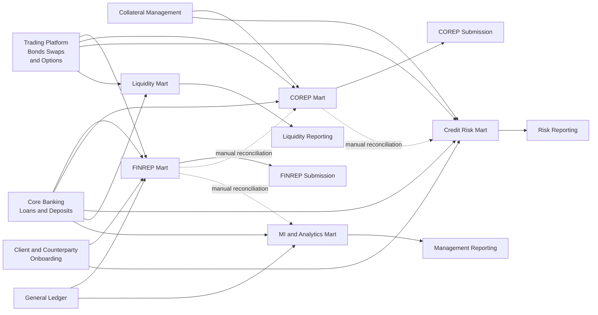
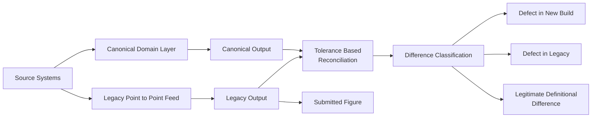

# Target and transition states

*From point-to-point extracts to a governed canonical domain layer — and the intermediate states that are worth funding on their own.*

---

## Purpose and scope

This document describes the current, transition and target states for a banking data domain that must serve **both** regulatory reporting and analytics from the same foundation. It is the architectural companion to [ADR-0001](../governance/adr/0001-canonical-domain-model-over-point-to-point.md) (canonical model over point-to-point) and [ADR-0004](../governance/adr/0004-target-architecture-lakehouse-hybrid.md) (governed lakehouse with domain ownership). Those documents establish *what* was decided and *why*. This one establishes *how you get there without the programme collapsing halfway*.

The audience is architects, delivery leads and the CDO function. It assumes the reader accepts the canonical-model argument and now has to sequence several years of work against a moving regulatory calendar.

One framing point before anything else. A target state is cheap to draw and worthless on its own. The scarce artefact is a **credible transition path in which every intermediate state is independently valuable and independently stoppable** — because multi-year data programmes routinely have their funding cut, re-scoped or absorbed into a cost programme mid-flight, and a transition state that only pays off at the end is not a plan, it is a liability with a Gantt chart attached.

---

## 1. Current state

### 1.1 The honest starting position

Most institutions are not starting from nothing, and they are not starting from chaos either. They are starting from something worse than both: an estate of individually reasonable decisions that compose into an unmanageable whole.

The pattern is consistent. A regulatory obligation arrives with a deadline. A programme is stood up to meet it. The fastest route to the deadline is an extract from each contributing source system straight into a purpose-built mart shaped like the report. The deadline is met, the programme is closed, the team is redeployed. Two years later the next obligation arrives, and the fastest route to *that* deadline is a new set of extracts into a new mart — because the previous mart is shaped like the previous report and nobody is willing to take a dependency on a structure they cannot change.

Repeat five or six times over fifteen years and you have the current state.

Note what the diagram does *not* show, because it cannot: each of those arrows carries its own definition of counterparty, its own treatment of intragroup positions, its own cut-off convention and its own set of undocumented exclusions accumulated over a decade of fixes. The topology is bad. The semantic divergence hidden inside the topology is worse.

### 1.2 What this produces, and what each pathology costs

| # | Pathology | Mechanism | What it costs |
|---|---|---|---|
| **1** | **The same concept defined differently in each mart** | Each extract embeds its own interpretation of *counterparty*, *exposure*, *default*, *product*. Nobody wrote the interpretations down; they are in SQL. | Cross-report questions become projects. "Why does risk show a larger exposure to this group than finance?" takes weeks and produces an answer nobody fully trusts. |
| **2** | **Reconciliation performed by hand** | Differences between marts are found at period end by analysts comparing extracts in spreadsheets, against tolerances agreed verbally. | A recurring, unbudgeted, quarter-end labour cost that scales with the number of marts. Worse: the knowledge of *why* two numbers legitimately differ lives in the analyst, not the estate. |
| **3** | **Lineage reconstructed retrospectively** | Nobody captured how a figure was produced. When a supervisor asks, an archaeology exercise begins across code, jobs and people's memories. | Response times measured in weeks. The reconstruction is a best-effort narrative, not evidence — and it is visibly a narrative to anyone reading it. Directly at odds with [ADR-0003](../governance/adr/0003-lineage-as-a-first-class-artefact.md) and DP-18. |
| **4** | **Change cost scales with the number of marts** | A new product, a changed source field or a taxonomy update must be implemented separately in every mart that touches it, by different teams, on different schedules. | Linear-to-superlinear change cost. The estate becomes progressively less able to absorb regulatory change, precisely as regulatory change accelerates. |
| **5** | **No reproducibility of a submitted figure** | Marts are overwritten in place. Reference data is current-state only. Code is deployed without period pinning. | A figure submitted eighteen months ago cannot be regenerated. Restatement analysis becomes guesswork. Fails DP-29 and DP-34 outright. |
| **6** | **Source systems carry undocumented reporting semantics** | Because extracts were the fast path, reporting-specific logic drifted *into* source systems as flags and bespoke fields maintained for one downstream consumer. | Source system changes break reports in ways nobody predicted. The source team does not know who consumes the field or why it exists. |
| **7** | **Ownership is by pipeline, not by concept** | Each mart has an owner. The concept of *counterparty* has none. | Nobody can authorise a definitional decision. Disagreements escalate to a forum that has no basis for deciding, and are resolved by whoever is most senior in the room. |
| **8** | **Analytics competes with reporting for the same scarce data** | Analysts cannot use the regulatory marts (wrong shape, restricted, period-locked), so they build their own extracts. | A third population of numbers, with no governance at all, that inevitably ends up in a management pack contradicting the regulatory one. |

### 1.3 Why it persists

It persists because **every individual decision that produced it was locally rational**. The extract was genuinely the fastest way to hit that deadline. Not taking a dependency on someone else's mart was genuinely the lower-risk choice. Declining to fund the shared layer was genuinely defensible when the shared layer had no consumers yet.

This matters for how you make the argument. The current state is not evidence of incompetence, and framing it that way loses the room instantly. It is evidence of an estate that has never had a mechanism for making the *globally* rational decision — which is precisely what an architecture function and a design authority exist to supply.

---

## 2. Target state

### 2.1 Shape

```mermaid
flowchart LR
  subgraph SRC[Source Systems]
    S1[Core Banking]
    S2[Trading and<br/>Position Keeping]
    S3[Collateral Management]
    S4[Counterparty Onboarding]
    S5[General Ledger]
  end

  subgraph LAND[Landing]
    L1[Immutable Raw Landing<br/>source shape preserved]
  end

  subgraph CANON[Canonical Domain Layer]
    C1[Party]
    C2[Arrangement]
    C3[Instrument]
    C4[Trade Event]
    C5[Position]
    C6[Collateral]
    C7[Classification]
  end

  subgraph LENSES[Lens Layer]
    X1[FINREP<br/>accounting lens]
    X2[Counterparty Credit Risk<br/>prudential lens]
    X3[Analytical Models]
  end

  subgraph SERVE[Certified Serving]
    V1[Submission Datasets<br/>versioned and reproducible]
    V2[Governed Self Serve]
  end

  META[Lineage Graph and<br/>Active Metadata]
  LINT[Policy Conformance Linter]

  SRC --> LAND
  LAND --> CANON
  CANON --> LENSES
  LENSES --> SERVE
  CANON -. emits .-> META
  LENSES -. emits .-> META
  META -. checked by .-> LINT
```

### 2.2 Layer responsibilities — and prohibitions

The prohibitions column is the load-bearing one. Layered architectures do not fail because people forget what a layer is *for*; they fail because nobody wrote down what a layer is *not allowed to do*, and under deadline pressure the nearest layer absorbs the work.

| Layer | Responsibility | What it is **not** allowed to do |
|---|---|---|
| **Source systems** | Own the operational truth of their business process. Publish complete, timely extracts in their own shape. | Must not hold reporting-specific logic, flags or fields maintained solely for a downstream report. Must not be read directly by any consumer (DP-10). |
| **Landing** | Preserve source data exactly as received, immutably, with technical metadata and receipt time. Enable replay. | Must not transform, cleanse, deduplicate, join or interpret. Must not be a consumption point for anything except canonical transformation. No business rules whatsoever. |
| **Canonical domain layer** | Hold the single conformed representation of the domain concepts — Party, Arrangement, Instrument, Trade Event, Position, Collateral, Classification — with declared business keys, bi-temporality where required, ownership and quality rules. Resolve identity across systems. | Must not contain report-shaped structures, output-specific derivations or anything named after a regulatory framework. Must not be source-shaped or product-shaped (DP-12). Must not be bypassed. |
| **Lens layer** | Apply the framework-specific interpretation: accounting measurement and supervisory breakdowns for FINREP; exposure measurement, netting and collateral recognition for CCR; feature construction for analytics. Hold the logic that *legitimately differs* between lenses. | Must not create or resolve entities. Must not hold entity-level business logic that belongs in the canonical layer (DP-11). Must not read landing or source directly. Must not silently reconcile itself to another lens. |
| **Certified serving** | Publish versioned, period-pinned, reproducible datasets for submission and for governed consumption, with lineage and quality evidence attached. | Must not be edited. Must not accept manual adjustments that are not themselves modelled, attributed and dated. Must not be regenerated in place under a previously published version. |
| **Lineage and active metadata** | Capture the six-component lineage on every regulatory-facing field, drive impact analysis, entitlement and conformance checking. | Must not be maintained by hand. Must not be optional for a pipeline to be deployable. Must not be a descriptive catalogue that nothing enforces. |

### 2.3 The properties this buys

| Property | How the target state delivers it |
|---|---|
| **One definition per concept** | The concept exists once, in the canonical layer, with one named owner (DP-01). Lens-specific differences are explicit transformations *from* that definition, not competing definitions. |
| **Two lenses that disagree honestly** | FINREP and CCR are permitted to produce different numbers for the same trade, and the difference is *derivable and explainable* because both descend from the same canonical facts ([ADR-0002](../governance/adr/0002-one-model-two-lenses.md)). |
| **Reproducibility** | Data, code, reference data and lineage retained together and pinned per reporting period (DP-29, DP-34). |
| **Change cost proportional to the change** | A new product is modelled once. A taxonomy update lands in one lens. Impact is *queried* from the lineage graph, not estimated in a workshop. |
| **Analytics on the same foundation** | Analysts consume the canonical layer, not their own extracts. The management number and the regulatory number descend from common ancestors, so divergence is explainable rather than embarrassing. |

---

## 3. Transition states

### 3.1 The design rule

**Each transition state must be independently valuable and independently stoppable.**

Stated plainly: if the programme is cancelled at the end of any transition state, the organisation must be measurably better off than before it started, and the delivered capability must not require the next state to function. This rule is not a nicety. It is the single most important structural constraint on a multi-year data programme, and it should be applied ruthlessly when someone proposes a two-year foundational phase with no consumer.

It has a corollary that architects dislike: **you will sometimes deliver in an order that is not the architecturally elegant one**, because the elegant order back-loads all the value. Accept it.

### 3.2 Transition state T1 — Know the estate you have

*Ownership, definitions and lineage over the current estate. No data movement. No new platform.*

| | |
|---|---|
| **What changes** | Every regulatory-facing figure gets a named owner and a named accountable executive (DP-01, DP-04). The existing point-to-point pipelines are instrumented to emit lineage as data rather than have it documented (DP-18). Definitions for the top shared concepts are written and published. Code lists and taxonomy versions are pinned (DP-38, DP-40). The conformance linter runs over what exists, in report-only mode. |
| **What it delivers on its own** | The ability to answer a supervisory information request about how a figure was produced in days rather than weeks. A defensible, evidenced impact analysis capability. A published register of who owns what. This is genuine, immediate, standalone value — several of the most painful regulatory findings in this area are about exactly this and nothing else. |
| **What stays broken** | Everything structural. The same concept is still defined differently in each mart — the difference is that now you can *see* it and quantify it. Reconciliation is still manual. Change cost is unchanged. Nothing is reproducible yet. |
| **Entry criteria** | Sponsor at executive level. Agreement that lineage is emitted by pipelines, not maintained in a tool by hand. Access to the existing pipeline code. |
| **Exit criteria** | Lineage captured for an agreed regulatory-facing scope. Owner and steward recorded for every canonical concept in scope. Linter running in report-only mode with a published, owned backlog of violations. Definitional divergences documented with a quantified impact. |
| **Risks** | Instrumenting legacy pipelines is unglamorous and is the first thing cut. The divergence register is politically uncomfortable — it names numbers that do not agree. Mitigate by agreeing *in advance* that the register is a planning input, not an audit finding. |

### 3.3 Transition state T2 — One canonical core, one lens, in parallel

*Build the canonical layer for the highest-pain domain and run one regulatory output over it, alongside the legacy feed.*

| | |
|---|---|
| **What changes** | Canonical entities are built for one domain slice — for a derivatives-heavy institution, typically Party, Instrument, Trade Event and Collateral. One regulatory output is rebuilt over it and run in parallel with the incumbent feed (see §4). The self-serve platform capability starts here: model registry, DDL generation, lineage-emitting pipeline framework, linter in the pull request. |
| **What it delivers on its own** | A proven canonical model with a real consumer, not a diagram. A reproducible parallel-run output. Most valuably, a *quantified* reconciliation between the canonical result and the legacy result, which permanently converts "the numbers do not agree" from folklore into a classified list of explained differences. |
| **What stays broken** | Only one lens exists, so the central claim of the architecture — that one model serves two disagreeing lenses — is asserted, not demonstrated. Other reports still run point-to-point. The legacy feed still runs, and costs money. |
| **Entry criteria** | T1 exit met for the chosen domain. Canonical model reviewed and accepted by the design authority. The receiving report team has agreed to a parallel run and has capacity at period end — this is a real constraint and is routinely underestimated. |
| **Exit criteria** | Canonical output within agreed tolerance of legacy for an agreed number of consecutive periods, with every difference classified. Lineage complete to field level for regulatory-facing fields (DP-19). Reproducibility demonstrated by regenerating a prior period exactly (DP-29). |
| **Risks** | The parallel run reveals that the *legacy* number was wrong. This is a success of the method and a crisis for the organisation; decide the escalation route before you start, not when it happens. Second risk: the canonical model is quietly bent to reproduce legacy quirks in order to close differences faster. Guard this in review — a difference explained is worth more than a difference eliminated. |

### 3.4 Transition state T3 — Second lens on the same core

*Add the second regulatory output over the same canonical layer without extending it for that purpose.*

| | |
|---|---|
| **What changes** | The second lens — the prudential one, if T2 delivered the accounting one — is built over the canonical layer. Cross-lens impact assessment becomes a standing control (DP-35). Where the two lenses legitimately differ, the difference is modelled explicitly rather than reconciled after the fact. |
| **What it delivers on its own** | The architectural claim is now *demonstrated*: one model, two lenses, differences explainable by construction. Cross-lens questions become queries. This is the state in which the investment case for the remaining domains stops being theoretical, and it is the right moment to seek the next tranche of funding. |
| **What stays broken** | Coverage. Other domains are untouched; other reports are still point-to-point. The legacy feed for the T2 report may still be running if decommissioning has slipped — see §4.4. |
| **Entry criteria** | T2 exit met and the T2 legacy feed formally decommissioned or on a dated, owned decommissioning plan. The second lens's owning function has agreed to the canonical definitions of shared concepts. |
| **Exit criteria** | Second lens in production. A documented, quantified explanation of the differences between the two lenses for a common population. No canonical entity extended solely to serve the second lens without design authority approval. |
| **Risks** | The strongest pressure in the whole programme lands here: to add a lens-specific field to a canonical entity because it is faster than modelling the concept properly. Every such concession is a future polyseme. Route them all through the forum; expect to lose some, and record those as debt with an expiry. |

### 3.5 Transition state T4 — Widen coverage and certify serving

*Onboard remaining domains in waves; formalise the certified serving layer for both submission and analytics.*

| | |
|---|---|
| **What changes** | Remaining domains onboard onto the canonical layer in waves, each wave following the §4 migration pattern. The certified serving layer is formalised: versioned submission datasets, governed self-serve for analysts, entitlement driven by classification (DP-26, DP-27). Analytics is deliberately migrated off private extracts. |
| **What it delivers on its own** | Estate-wide consistency for the migrated scope and the end of the parallel-truth problem between management and regulatory reporting for those domains. |
| **What stays broken** | Whatever was deliberately left alone (§5) — and that is correct, not a gap. Coverage will never be one hundred per cent, and a plan that assumes it will is not a plan. |
| **Entry criteria** | T3 exit met. Platform capability mature enough that a domain can onboard without the central team writing its pipelines. |
| **Exit criteria** | Agreed scope migrated. Decommissioning complete for each migrated feed. Certified serving in use by both regulatory and analytical consumers. |
| **Risks** | Fatigue and dilution: the central team becomes a bottleneck for onboarding, or standards are relaxed to hit wave dates. Mitigate by measuring onboarding lead time as a first-class metric and treating a rising trend as an architectural defect. |

### 3.6 Value if stopped — the test that matters

| Stopped after | Organisation is better off because | Residual liability |
|---|---|---|
| **T1** | Lineage, ownership and definitional divergence are known and evidenced; supervisory responses are fast. | Instrumentation must be maintained or it decays. |
| **T2** | One report is reproducible, canonical and cheaper to change; the model is proven. | One canonical layer with a single consumer looks like overhead until a second consumer exists. |
| **T3** | Two lenses provably consistent; cross-lens questions answerable; the pattern is transferable. | Two architectures now run side by side. This is the most expensive place to stop — see below. |
| **T4** | Target state achieved for agreed scope. | Ongoing platform and stewardship cost, which is permanent and must be in run budget, not programme budget. |

Stopping after T3 is survivable but is the worst of the four, because you are carrying both the new architecture and most of the old one. If the funding signal is uncertain, bias effort towards *completing decommissioning* within T2 and T3 rather than starting T4 breadth.

---

## 4. Migration pattern: one report at a time

### 4.1 Shape of a parallel run

Note the last edge. **During parallel run, the legacy output remains the submitted figure.** The canonical output is a candidate. Reversing that before the cutover criteria are met is how a migration turns into an incident.

### 4.2 The stages

| Stage | Activity | Done when |
|---|---|---|
| **1. Scope and freeze** | Define the report, the population, the periods and the tolerance. Freeze the legacy logic for the duration except for mandatory fixes. | Scope signed by the report's accountable executive. Tolerances agreed *in advance and in writing*. |
| **2. Map, do not copy** | Map legacy logic to canonical concepts. Where legacy logic encodes an undocumented interpretation, surface it as a definitional decision for the forum. Resist reimplementing legacy SQL. | Mapping reviewed; interpretation decisions logged with owners. |
| **3. Build and instrument** | Build the lens over the canonical layer. Lineage emitted by construction. Linter clean or waived with expiry. | Linter passes at the required severity; lineage sufficient per DP-19. |
| **4. Parallel run** | Run both for an agreed number of consecutive periods, including at least one period-end with full close pressure. | Agreed number of clean consecutive periods achieved. |
| **5. Classify every difference** | Each difference assigned to exactly one of three classes (§4.3). No difference left as unexplained. | Difference register complete; no items in an unclassified state. |
| **6. Cutover** | Canonical output becomes the submitted figure. Legacy runs in shadow for a short, *dated* period. | Cutover criteria met (§4.4). |
| **7. Decommission** | Legacy feed switched off, code archived, extracts removed at source, licences and infrastructure released. | Evidence of actual removal, not intent (§4.5). |

### 4.3 Tolerance-based reconciliation

Two rules make this work.

**Set the tolerance before you see the numbers.** A tolerance agreed after the first comparison is not a control; it is a negotiation, and it will be renegotiated every time it is inconvenient. Tolerances should be materiality-based, agreed with the accountable executive, and differentiated — a tighter tolerance on headline aggregates than on granular breakdowns is legitimate; a tolerance that moves is not.

**Every difference is classified into exactly one of three classes, and the third is the valuable one:**

| Class | Meaning | Treatment |
|---|---|---|
| **A — Defect in the new build** | The canonical implementation is wrong. | Fix. The most common cause is an identity resolution or population-scoping error, not a calculation error. |
| **B — Defect in the legacy feed** | The legacy number was wrong, possibly for years. | Escalate immediately to the accountable executive under the established route. Do not quietly replicate the error to close the gap, and do not sit on it. |
| **C — Legitimate definitional difference** | Both implementations are internally correct; they encode different interpretations. | **This is the find.** It is documented, decided by the forum, recorded as a definitional decision, and — if material to a previously submitted figure — assessed for restatement (DP-31). |

Class C is why the exercise is worth doing beyond the migration itself. Every organisation carries a stock of undocumented interpretive differences between its reports; a parallel run is the only cheap mechanism that surfaces them systematically. Programmes that measure success purely by "differences closed" destroy this value by collapsing class C into class A and bending the new build to match the old one.

### 4.4 Cutover criteria

Cutover is a decision with named criteria, not a date in a plan.

| Criterion | Threshold |
|---|---|
| Consecutive clean periods | Agreed number achieved, including at least one full period-end close |
| Unexplained differences | Zero. Not "immaterial" — zero *unexplained* |
| Class B findings | Escalated and dispositioned |
| Class C findings | Decided by the forum and documented |
| Lineage | Sufficient per DP-19 for every regulatory-facing field |
| Reproducibility | A prior period regenerated exactly from pinned inputs (DP-29) |
| Operational readiness | Run book, support model, and period-end runbook rehearsed under time pressure |
| Rollback | Documented and tested, with a dated expiry |
| Sign-off | Accountable executive for the report; design authority for architectural conformance |

### 4.5 Decommissioning — the discipline that is actually hard

**Failure to decommission is the single most common reason these programmes leave the estate worse than they found it.** This deserves to be stated without hedging, because it is consistently underweighted at planning time and consistently fatal at review time.

The mechanism is entirely predictable. Cutover succeeds. The legacy feed is left running "for a quarter, just in case". Nobody wants to be the person who switched off the feed the month a supervisor asks a question. The just-in-case period has no owner and no expiry. Six months later someone discovers a report still consuming the legacy mart. Two years later the organisation is paying for both architectures, the legacy feed has drifted from the canonical one, and the programme's headline benefit — reduced change cost — has not materialised, because change must still be implemented twice.

At that point the honest assessment is that the programme *added* an architecture rather than replacing one. That is a worse estate than the one it started with, and it is how a well-executed build produces a failed outcome.

The discipline:

| Control | Specifics |
|---|---|
| **Decommissioning is in the same funding line as the build** | Never a follow-on phase, never a separate business case. If it is separable, it will be separated, and then cut. |
| **The shadow period is dated at cutover** | A named end date and a named owner, recorded before cutover happens. Extension requires the same approval as the original cutover. |
| **Consumers enumerated from lineage, not from memory** | The lineage graph tells you who actually reads the legacy mart. Asking around does not. This is a concrete payoff from T1. |
| **Switch off at the source, not just the target** | Remove the extract job and the source-side view. A dormant target with a live extract will be resurrected by someone under deadline pressure. |
| **Release the money and say so** | Licences, infrastructure, storage, the period-end labour. Publish the released cost. Unclaimed benefits are the reason the next tranche is refused. |
| **Definition of done includes removal evidence** | Not a decommissioning plan. Evidence that the thing is gone. |

---

## 5. What does not change

A target state that quietly implies rewriting everything is not credible and will not be funded. **Strangle, don't rewrite** applies here with unusual force, because the systems in question process real money under real operational risk and the failure mode of a rewrite is not a delayed release — it is a payments incident or a missed submission.

| Deliberately left alone | Why |
|---|---|
| **Core banking and trading platforms** | They are systems of record for operational processes. The architecture changes how data is *consumed from* them, not how they work. Replacing them is a different programme with a different risk profile, and coupling the two guarantees both fail. |
| **The general ledger and the accounting close** | The close is a controlled, audited, time-boxed process with its own governance. The canonical layer consumes accounting outcomes and models the relationship between economic and accounting views; it does not attempt to re-perform the close. |
| **Vendor packages without a data team** | Some sources cannot be changed at all. The architecture must absorb their shape at the landing boundary rather than demand they conform — this is precisely what landing is for. |
| **Regulatory submission and filing tooling** | The last mile — taxonomy binding, validation, filing — is a well-served, low-differentiation capability. Replace the pipeline that feeds it, not the tool. |
| **Genuinely local analytical assets** | A team's private working data with no regulatory footprint and no cross-domain consumers does not need to be canonical. Bringing it in-scope inflates the programme and buys nothing. Governance attaches when an asset is *shared*, not when it exists. |
| **Working reconciliations with real controls value** | Some manual reconciliations are compensating controls that should survive automation of the underlying feed, at least until the automated path has a track record. Removing a control because its cause was fixed is a step to take deliberately, later. |

The general test: **change the flow of data, not the systems that create it.** Where an architecture demands a source system change, that demand needs its own justification and its own owner, and it should be rare enough to be memorable.

---

## 6. Sequencing

### 6.1 The order

| Order | What | Why here |
|---|---|---|
| **1** | Ownership and definitions for shared concepts | Everything downstream depends on someone being able to decide what a word means. Cheap, fast, and it exposes the disagreements early while they are still cheap. |
| **2** | Lineage instrumentation over the existing estate | Standalone value, and it produces the consumer map needed for every subsequent decommissioning. |
| **3** | Canonical core for the highest-pain domain | Proves the model against the hardest case (see §6.2). |
| **4** | First lens, parallel run, cutover, **decommission** | The full pattern executed once, end to end, including the part everyone skips. |
| **5** | Second lens on the same core | Demonstrates the architectural claim; unlocks the funding argument. |
| **6** | Platform self-serve capability | Deliberately *after* two real consumers. A platform built before its users encodes guesses. |
| **7** | Remaining domains in waves | Now a repeatable pattern rather than a research exercise. |

### 6.2 Start with the most painful obligation, not the easiest

The instinct is to start with an easy domain: a clean source, a simple report, a cooperative team. Deliver a quick win, build confidence, move on.

Resist it. **Start with the domain carrying the most painful regulatory obligation.** The reasons are structural, not motivational:

**A model proven on the easy case is not proven.** Canonical models fail on complexity — netting sets, collateral, lifecycle events, identity across systems, bi-temporality. A model validated against simple products will need rework precisely when it is load-bearing, and rework of a canonical layer with live consumers is the most expensive change in this architecture.

**The painful domain is where the money is.** Benefits track pain: manual effort, findings, remediation cost, change lead time. The easy domain has the least of all four, so the pilot delivers a benefit too small to justify the next tranche — and then you are defending a platform on faith.

**Attention is a real asset with a real half-life.** A painful obligation comes with executive sponsorship, a supervisory interest and a mandate that will not exist in eighteen months. Spending that mandate on the easy domain wastes the scarcest resource in the programme.

**It changes what the organisation believes.** Solving the hard case makes the architecture credible in a way no amount of documentation achieves. Solving the easy case invites the entirely reasonable objection that it would never work on the real problem.

The honest counter-arguments, and the answer to each:

| Objection | Response |
|---|---|
| "Higher risk of failure" | True. Manage it with the parallel run — the legacy feed keeps submitting throughout. The downside is a delayed benefit, not a missed submission. |
| "The hard domain's team is busiest" | Also true, and it is why executive sponsorship must be secured before the work starts rather than sought when capacity is short. |
| "We will learn on the easy one first" | You will learn things that do not transfer. Nothing about a simple product teaches you how to model a netting set. |
| "We need a quick win for credibility" | Take the quick win in T1 — ownership, definitions, lineage. It is fast, visible and genuinely useful. Do not spend the *canonical build* on it. |

One qualification, stated honestly: if the organisation has never delivered anything of this kind and has no platform capability at all, a short, explicitly time-boxed capability-building exercise on a simpler slice is defensible — provided it is labelled as a *dry run*, is not represented as the pilot, and is not permitted to set the canonical model's shape.

---

## 7. How this goes wrong

| Anti-pattern | Symptom | Counter |
|---|---|---|
| **Foundation-first with no consumer** | Two years of canonical modelling before any output exists | Every transition state has a live consumer or it is not a transition state |
| **Big-bang cutover** | All reports move in one release | One report at a time, parallel run, no exceptions |
| **Migration by SQL translation** | Legacy logic reimplemented verbatim in the new layer | Map to concepts, not to code; class C differences are outputs, not obstacles |
| **Tolerance drift** | Tolerances loosened to close the gap | Tolerances fixed in advance and owned by the accountable executive |
| **Decommissioning as phase two** | Both architectures running at year three | Decommissioning inside the same funding line, dated at cutover |
| **Canonical layer as a dumping ground** | Lens-specific fields appearing on canonical entities | Design authority review on every canonical change (DP-33), with debt recorded and expiring |
| **Coverage as the goal** | Programme measured by tables migrated | Measure change lead time, reproducibility and decommissioned feeds |

---

## 8. Document control

| Item | Value |
|---|---|
| Owner | Domain Data Architect |
| Approval body | Data Architecture Forum / Design Authority |
| Review cycle | Annual, or on material change to the regulatory reporting footprint |
| Related decisions | [ADR-0001](../governance/adr/0001-canonical-domain-model-over-point-to-point.md), [ADR-0002](../governance/adr/0002-one-model-two-lenses.md), [ADR-0003](../governance/adr/0003-lineage-as-a-first-class-artefact.md), [ADR-0004](../governance/adr/0004-target-architecture-lakehouse-hybrid.md) |
| Companion documents | [`domain-data-flows.md`](domain-data-flows.md), [`methodology-decision.md`](methodology-decision.md), [`../governance/data-policy-standards.md`](../governance/data-policy-standards.md) |

*Reference architecture, not a compliance artefact. Synthetic data throughout. Regulatory frameworks are described at a conceptual level only — verify all detail against the current published EBA and ECB texts before relying on it for any submission.*
